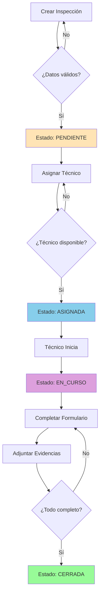
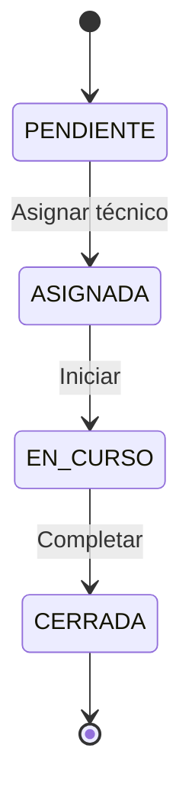

# Diagramas de Flujo de Inspecciones

## Etapas del Proceso

1. **Creación**: El administrador crea una inspección
2. **Asignación**: Se asigna la inspección a un técnico
3. **Ejecución**: El técnico realiza la inspección
4. **Registro**: Se registran respuestas y evidencias
5. **Cierre**: La inspección se marca como completada

## Estados de la Inspección

### PENDIENTE
La inspección fue creada pero no tiene técnico asignado.
- El administrador puede editarla o cancelarla
- Requiere: tipo de inspección, empresa, ubicación, fecha programada

### ASIGNADA
La inspección tiene un técnico asignado pero no ha iniciado.
- El técnico puede verla en su lista de tareas
- Se puede reasignar si es necesario

### EN_CURSO
El técnico está ejecutando la inspección.
- Se registran respuestas del formulario
- Se adjuntan evidencias (fotos, documentos)
- El técnico puede guardar progreso parcial

### CERRADA
La inspección está completada.
- Todos los datos obligatorios están completos
- No se puede modificar
- Disponible para reportes

## Diagrama de Flujo Principal

## Transiciones de Estado

## Puntos de Decisión

**1. Validación de Datos (Creación)**
- ¿El tipo de inspección existe?
- ¿La fecha programada es válida?
- ¿La empresa es válida?

**2. Validación de Técnico (Asignación)**
- ¿El técnico está registrado?
- ¿El técnico tiene el rol correcto?
- ¿El técnico está activo?

**3. Validación de Completitud (Cierre)**
- ¿Todas las preguntas obligatorias están respondidas?
- ¿Las evidencias requeridas están adjuntas?

## Validaciones por Etapa

**Creación**
- Tipo de inspección válido ✓
- Empresa válida ✓
- Fecha programada ✓

**Asignación**
- Técnico registrado ✓
- Técnico con rol correcto ✓
- Técnico activo ✓

**Cierre**
- Campos obligatorios completos ✓
- Evidencias adjuntas ✓

## Relación con el Modelo SQL

La tabla `inspections` incluye:
- `status`: PENDIENTE, ASIGNADA, EN_CURSO, CERRADA
- `assigned_technician_id`: Se asigna al pasar a ASIGNADA
- `started_at`: Se registra al pasar a EN_CURSO
- `closed_at`: Se registra al pasar a CERRADA

## Relación con el Modelo NoSQL

El documento de respuestas incluye:
- `inspection_id`: Referencia a la inspección en SQL
- `responses`: Array de respuestas del formulario
- `evidence`: Array de evidencias adjuntas
- `status`: Sincronizado con el estado en SQL